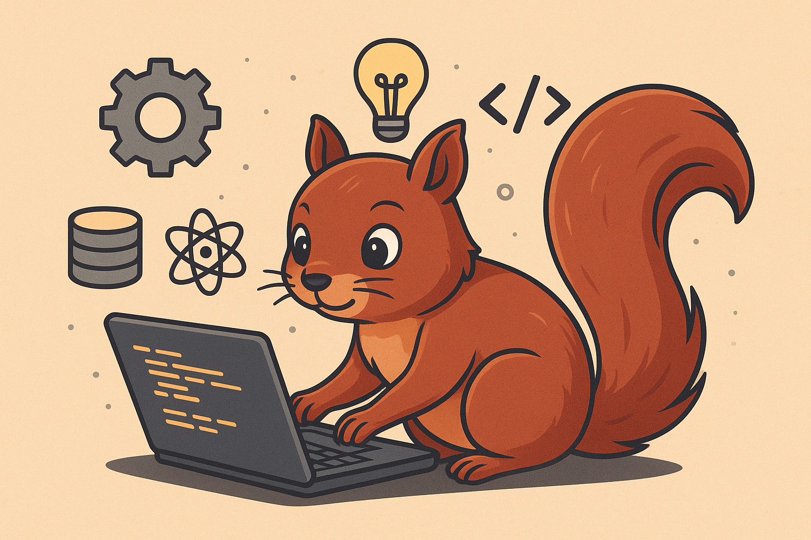

<!--
Credits and references used in this README:

1) Layout ideas and section inspiration:
   https://github.com/abhisheknaiidu/awesome-github-profile-readme?tab=readme-ov-file#descriptive-

2) Skill icons (SVG badges):
   https://github.com/tandpfun/skill-icons?tab=readme-ov-file#icons-list

3) GitHub stats card:
   https://github.com/anuraghazra/github-readme-stats
-->

# 🐿️ Sakshi Kirmathe
**`Data Science | AI/ML enthusiast`**

### About Me
- 🔭 Currently working on applied LLMs & intelligent data workflows  
- 👯 Open to collaborating on data analysis, AI agents & automation projects  
- ⚡ You know nothing, broken code. *Valar Deployulis!*

---

### 🛠️ Tech Stack

**1. Core**  

  

**2. Web & Backend**  

  

**3. Tools**  

  

**Comfortable with**: Python, MySQL, Data Visualization  

---

### Projects - Showcase  

<table>
  <tr>
    <td align="center" width="33%">
      <b>CareerLens: AI Counseling Summarization</b>  
      

        Built an AI system for real-time counseling transcripts and generate
        multilingual, context-aware summaries using fine-tuned LLaMA 3.1.
        Implemented Q&A, action-item extraction, and a dashboard for structured
        career insights and recommendations.
      

      🔗 <a href="#">Repo</a>  
      Tags: Python, NLP, LLMs, Unsloth, PEFT (QLoRA), Flask
    </td>
    <td align="center" width="33%">
      <b>Gesturely: Gesture Translation System</b>  
      

        Developed a real-time Indian Sign Language (ISL) recognition pipeline using
        pose landmarks and DL models for gesture classification.
        Converted gestures into grammatically correct English sentences using NLP
        to improve accessibility.
      

      🔗 <a href="#">Repo</a>  
      Tags: OpenCV, Deep Learning, MediaPipe, CNN, LSTM
    </td>
    <td align="center" width="33%">
      <b>PEP Candidates Scraping & Analysis</b>  
      

        Automated scraping of PEPs data using Playwright
        and Chromium, handled dynamic content, pagination, and structured extraction.
        Performed data transformation and exploratory analysis, and
        visualized trends using Power BI.
      

      🔗 <a href="#">Repo</a>  
      Tags: Playwright, Chromium, Data Scraping, Power BI, Excel
    </td>
  </tr>
</table>

---

### Stats  

---

### Links  

<table style="width:100%;">
  <tr>
    <td align="left" width="70%">
      
- 📄 [Know about my experiences](https://tinyurl.com/sakshikirmatheResume)  
- 📫 Email: **kirmathesakshi@gmail.com**  
- 💼 LinkedIn: [sakshikirmathe](https://www.linkedin.com/in/sakshikirmathe)  
- 📷 Instagram: [sakshi_kirmathe](https://www.instagram.com/sakshi_kirmathe)  
- 🧩 LeetCode: [jazzcode7](https://leetcode.com/u/jazzcode7)  

    </td>
    <td align="right" width="30%">
      
    </td>
  </tr>
</table>
